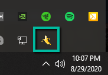

# \<Tentative> GearMate

## Getting Started

1) Download the [latest release](https://github.com/andrew-brainerd/raid-locker/releases/download/v1.0.0/tentative-guild-mate-Setup-1.0.0.exe) of \<Tentative> GearMate

2) Install the application from `tentative-guild-mate-Setup-1.0.0.exe`

3) Click on the '\<Tentative> GearMate' icon in the system tray

   
